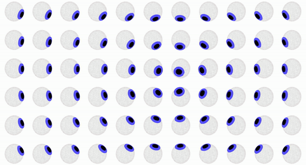

# Adocchio
Ai tempi di tracking, detection e indiscreti sguardi digitali, Adocchio è un’installazione interattiva che al contrario invita il visitatore a conquistare l'attenzione della macchina. Questo digital gaze è di fatto un muro di occhi artificiali, che mostra però caratteristiche inaspettatamente umane: è indisciplinato, si distrae facilmente, si stanca, si appisola. Sta al visitatore destarlo, intrattenerlo e farsi seguire nello spazio.

In these times of tracking, detection and indiscreet digital tools, Adocchio is an interactive installation that goes against the flow by daring visitors to grab machines' attention. Its digital gaze looks out from a wall of artificial eyes, but acts unexpectedly human: it's unruly, gets distracted, tires easily, and dozes off. It's up to visitors to wake it up, entertain it, and get it to follow them across the space.



## Autori
[`Marta Monge - Illustrator`](https://martamonge.me/)
[`Kerem Türkyilmaz - Coder`](https://www.kerem.ch/)

## Specifiche 
```
Last release: 02/02/2021

Tested on Chrome v91.0.4472.164

Stable version tested with:
Vue     - v2.6.14
Node    - v14.12.0
NPM     - v6.14.4
```

## Setup

```
# Clone
git clone git@github.com:KeremTurkyilmaz/Adocchio.git

# Move into cloned repo
cd Adocchio/

# Install node modules
npm install

# Compiles and hot-reloads for development
npm run dev

# Compiles and minifies for production
npm run build
```
